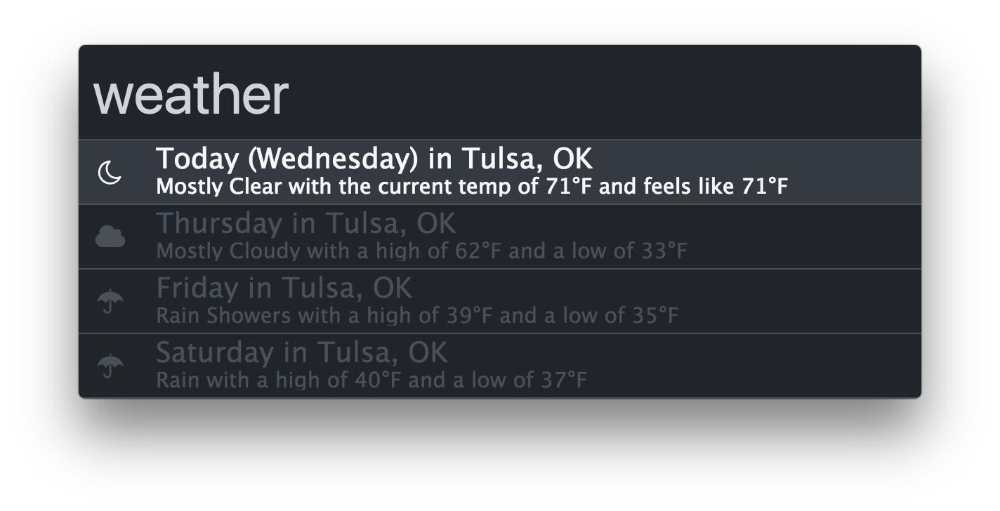
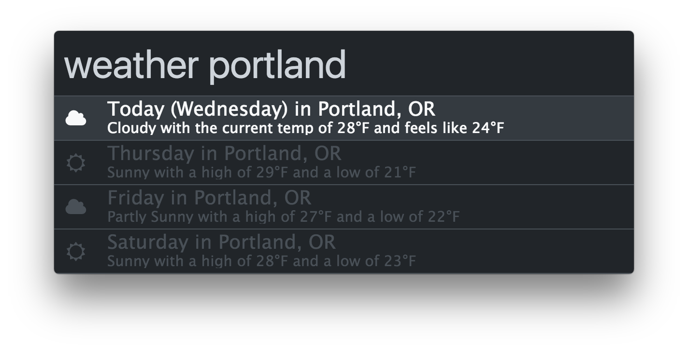

## Zazu Weather

Just type in `weather` to get weather for your current location:

Optionally, add a location to get weather in that location:

## Installing

If you want it to guess your location, just add it to your `~/.zazurc.json`
file:

~~~ json
{
  "plugins": [
    "blainesch/zazu-weather"
  ]
}
~~~

To overwrite the location:

~~~ json
{
  "name": "blainesch/zazu-weather",
  "variables": {
    "location": "Portland, OR"
  }
}
~~~

To overwrite the degree type to Celsius (Fahrenheit is the default)

~~~ json
{
  "name": "blainesch/zazu-weather",
  "variables": {
    "degreeType": "C"
  }
}
~~~

Full options are:

~~~ json
{
  "name": "blainesch/zazu-weather",
  "variables": {
    "location": "Portland, OR",
    "degreeType": "C"
  }
}
~~~
